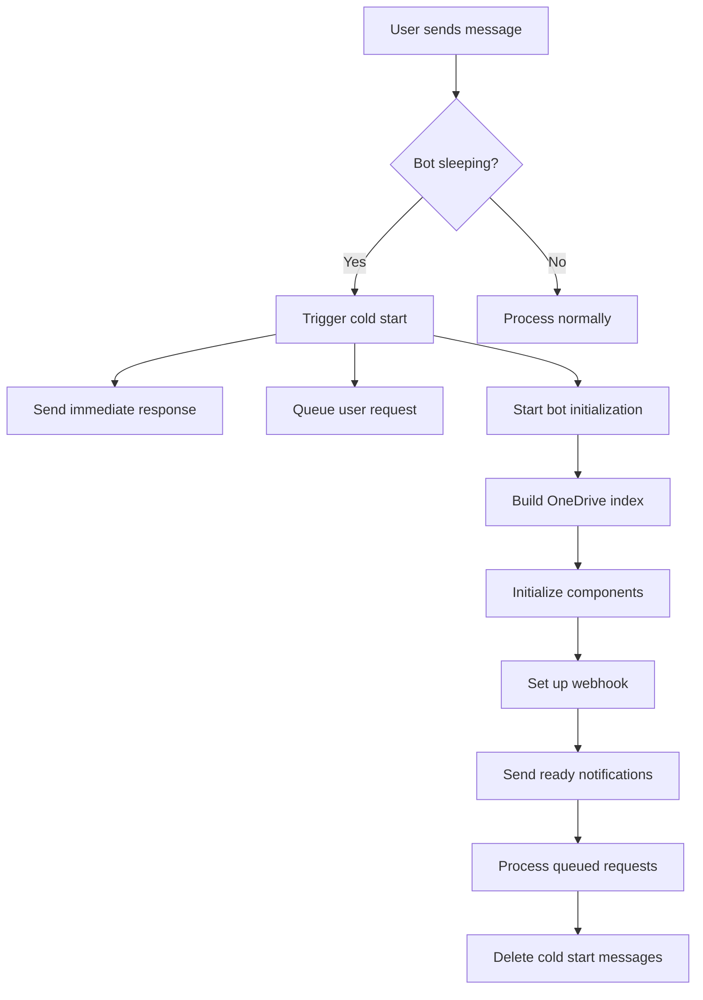

# Cold Start Message System - Enhanced Design

## Overview

The OneDrive Telegram Bot includes a sophisticated cold start message system designed specifically for Render.com hosting where the bot sleeps after inactivity and needs time to restart.

## Problem Statement

When hosted on Render's free tier:
- Bot sleeps after 15 minutes of inactivity
- Startup takes 10-30 seconds (sometimes longer)
- Users have no feedback when interacting with a sleeping bot
- User requests could be lost during startup
- Poor user experience without status indication

## Enhanced Solution

### 🎯 **Immediate User Response**
When a user interacts with a sleeping bot:

```
👋 Hi [User]!

🔄 OneDrive Bot is waking up...

The bot was sleeping due to inactivity and is now starting up. 
Your request has been received and will be processed automatically once ready.

⏱️ Expected startup time: 10-30 seconds
📁 What this bot does: Browse and download OneDrive files
🎯 Your request: Will be processed automatically - no need to resend!

🔔 This message will disappear once the bot is ready.
```

### 📊 **Progress Updates**
If startup takes longer than 15 seconds:

```
⏳ Still starting up...

The bot is taking a bit longer than usual to start. 
This sometimes happens when:
• Building the OneDrive file index
• Establishing secure connections
• Loading recent file updates

🔄 Almost ready! Your request is still queued.
```

### ✅ **Ready Notification**
When bot completes startup:

```
✅ Bot is now ready!

Processing your request now...
```

## Technical Implementation

### Core Components

1. **Cold Start Detection**
   ```python
   self.is_cold_start = True  # Set on startup
   self.pending_updates = []  # Queue for incoming requests
   self.cold_start_messages = {}  # Track messages for cleanup
   ```

2. **Message Queuing**
   - All user interactions during startup are queued
   - Processed automatically when bot is ready
   - No user requests are lost

3. **Progressive Communication**
   - Immediate acknowledgment (< 1 second)
   - Progress updates (if needed)
   - Ready notification
   - Automatic message cleanup

4. **Analytics Tracking**
   ```python
   self.cold_start_stats = {
       'startup_time': datetime,
       'first_user_contact': datetime,
       'total_users_contacted': int,
       'total_updates_queued': int,
       'startup_duration': timedelta
   }
   ```

### System Flow



### Enhanced Features

#### 🔄 **Smart Timeout Management**
- **Previous**: 5-minute static timeout
- **Enhanced**: 2-minute timeout with intelligent completion detection
- Handles edge cases where startup fails

#### 📱 **User Experience Improvements**
- **Personalized greetings** using user's first name
- **Clear expectations** about wait time and automatic processing
- **Educational content** about bot capabilities
- **Visual progress indication** with emojis and formatting

#### 📈 **Admin Analytics**
```
🟢 Bot Started (Render Webhook Mode)

📊 Cold Start Analytics:
• Users contacted during startup: 3
• Pending updates queued: 5
• Startup duration: 23.4s
• Startup completed: 14:32:15 UTC

✅ Processing queued user requests now...
```

#### 🛡️ **Error Handling**
- Graceful fallback if message editing fails
- Continues operation even if notifications fail
- Comprehensive logging for debugging
- Timeout protection for stuck startups

### Configuration

The system is automatically enabled in `app.py` for Render deployment. Key parameters:

```python
# Timing Configuration
COLD_START_TIMEOUT = 120  # 2 minutes
PROGRESS_UPDATE_DELAY = 15  # 15 seconds
READY_MESSAGE_DURATION = 3  # 3 seconds

# Message Configuration
PERSONALIZED_GREETINGS = True
PROGRESS_UPDATES = True
STARTUP_ANALYTICS = True
```

## Benefits

### For Users
- ✅ **Immediate feedback** - No confusion about bot status
- ✅ **No lost requests** - All interactions are queued and processed
- ✅ **Clear expectations** - Users know what's happening and how long it takes
- ✅ **Educational** - Users learn about bot capabilities during wait
- ✅ **Professional experience** - Feels responsive and well-designed

### For Administrators
- ✅ **Startup monitoring** - Detailed analytics on cold start events
- ✅ **Performance tracking** - Startup duration and user impact metrics
- ✅ **Proactive notifications** - Know when users are affected
- ✅ **Debugging information** - Comprehensive logs for troubleshooting

### For System
- ✅ **Resource efficiency** - No polling, webhook-based
- ✅ **Scalable design** - Handles multiple concurrent cold starts
- ✅ **Robust operation** - Continues working even with partial failures
- ✅ **Self-cleaning** - Automatic cleanup of temporary messages

## Usage Examples

### Scenario 1: Single User Cold Start
1. User sends `/start` to sleeping bot
2. Bot wakes up, user gets immediate "starting up" message
3. Bot completes startup in 15 seconds
4. User gets "ready" notification
5. Original `/start` command is processed
6. Cold start messages are deleted

### Scenario 2: Multiple Users During Startup
1. Three users interact with sleeping bot
2. All get personalized cold start messages
3. All requests are queued
4. Bot completes startup
5. All users get ready notifications
6. All requests are processed in order
7. All cold start messages are cleaned up

### Scenario 3: Extended Startup
1. User triggers cold start
2. Gets immediate acknowledgment
3. After 15 seconds, gets progress update
4. Bot completes startup after 45 seconds
5. User gets ready notification
6. Request is processed

## Monitoring and Analytics

### Log Entries
```
INFO: Sent enhanced cold start message to user 123456789 (Alice)
INFO: Queued update from user 123456789 during cold start (Total queued: 1)
INFO: Processing 3 pending updates from cold start
INFO: Bot fully initialized - cold start complete (duration: 23.4s)
```

### Admin Dashboard
The admin receives detailed startup reports including:
- Number of users affected
- Total requests queued
- Startup duration
- Performance metrics

## Future Enhancements

### Potential Improvements
1. **Predictive Cold Start** - Warm up bot based on usage patterns
2. **Status Page** - Web endpoint showing bot status
3. **Push Notifications** - Alternative communication during long startups
4. **Performance Optimization** - Faster startup through caching
5. **Regional Deployment** - Multiple instances for better performance

### Integration Opportunities
1. **Database Logging** - Store cold start events for analysis
2. **Monitoring Integration** - Connect with external monitoring services
3. **User Preferences** - Customizable cold start messages
4. **A/B Testing** - Test different message strategies

## Conclusion

The enhanced cold start system transforms a potential negative user experience (bot unresponsiveness) into a professional, informative interaction that:

- **Educates users** about the bot's capabilities
- **Manages expectations** with clear communication
- **Preserves all user requests** through smart queuing
- **Provides insights** to administrators
- **Maintains reliability** through robust error handling

This system is specifically designed for Render.com hosting but the principles can be adapted for any environment where bots experience startup delays.
